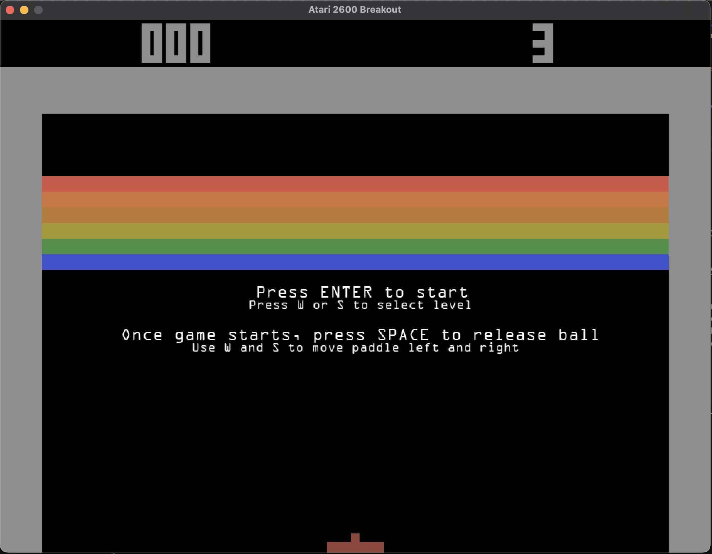
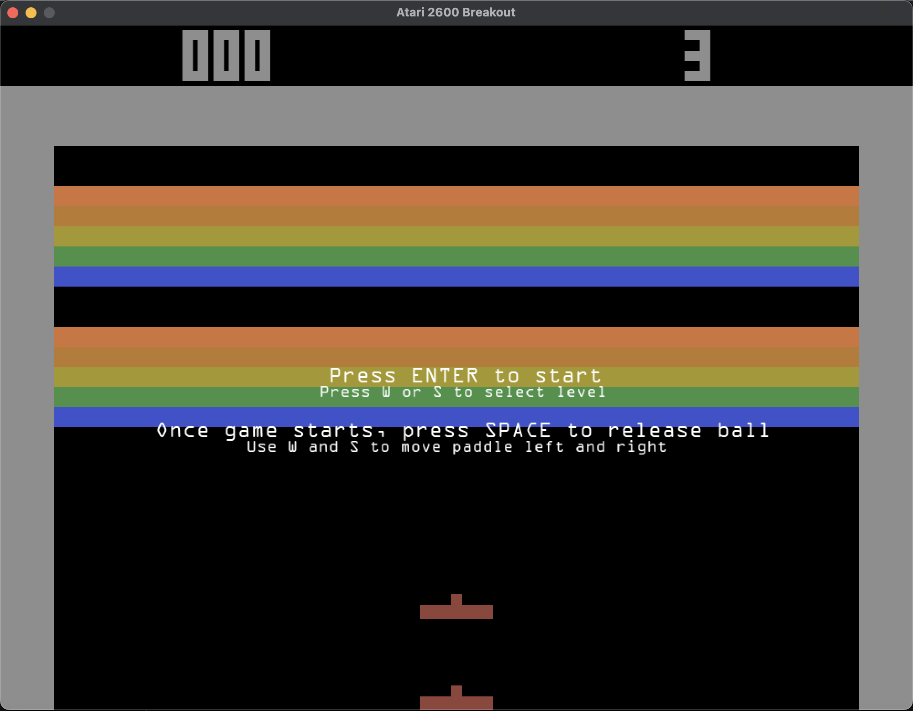
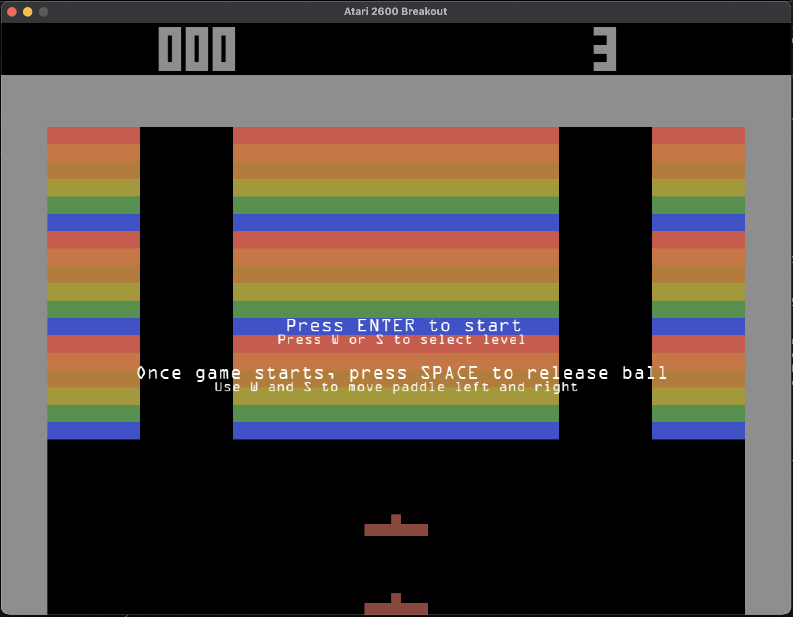
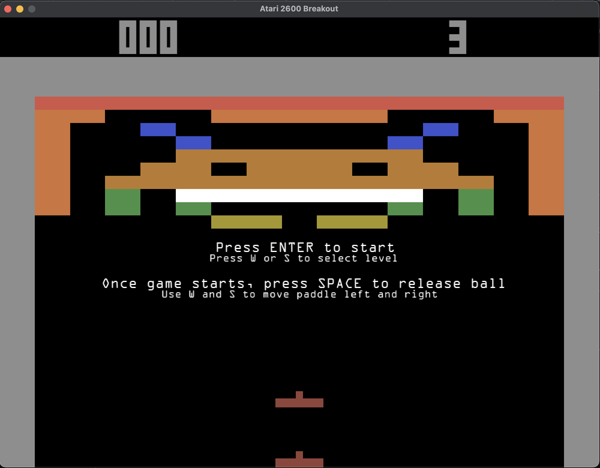
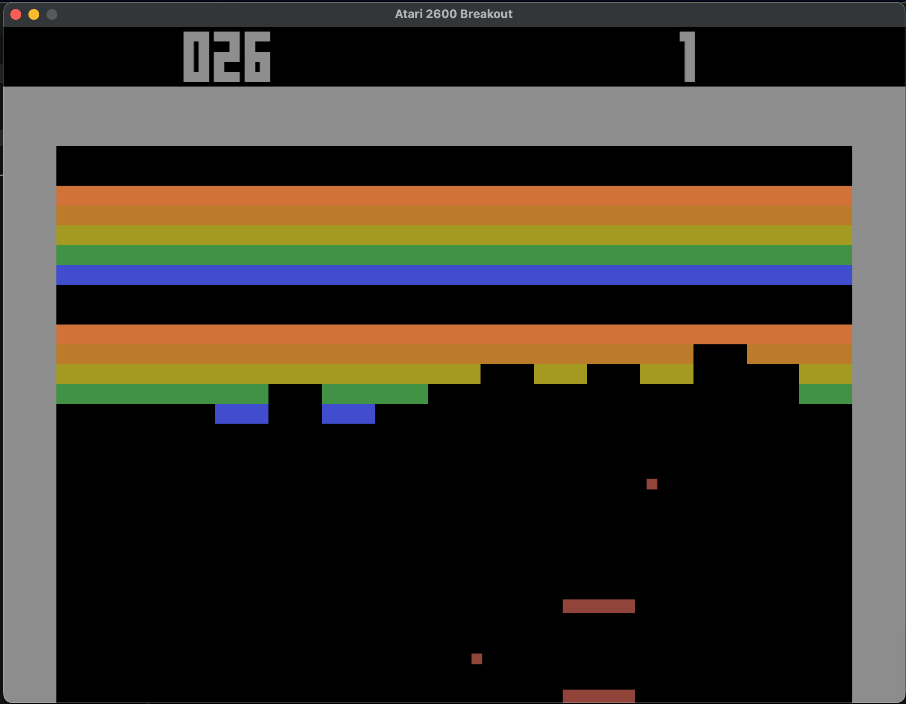

## Title: Atari 2600 Super Breakout

## YouTube/Dropbox/Drive Link: 
* YouTube: https://www.youtube.com/watch?v=gNeizMVD35g 
* Google Drive backup: https://drive.google.com/file/d/1qdMNljySF9DLCyL51PHLIzpD236UJyeQ/view?usp=sharing 

## Screenshots:

* Name
  * Team member 1: Justin Diament
* How many hours did it take you to complete this final project? 
  * It took me around 18 hours to complete this project
* Did you collaborate or share ideas with any other students/TAs/Professors?
  * I spoke with Professor Shah about ideas in his office hours, but other than that I did not collaborate with any other people.
* Did you use any external resources? 
  * Note it is fair to utilize some tutorials--cite them here. You **must** add your own personal touch however!
  * I used Joey DeVries' Breakout tutorial from learnopengl.com: https://learnopengl.com/In-Practice/2D-Game/Breakout 
  * Of course, I also added many personal touches, which are explained in my video. 
  * Additionally, I used some SDL2 code from the starter code from various homeworks from this course.
* (Optional) What was the most interesting part of the Final Assignment? How could the instructor improve the final project?
  The most interesting part of the Final Assignment was getting to choose my own topic for it. As I noted in my video, I'm a huge retro video game fan, so getting to make Breakout for my final project while using what I have learned in the course (and a little beyond the course content) was fun, despite the number of head-scratching bugs I dealt with. There is nothing I would do to improve the final project.

### Rubric

<table>
  <tbody>
    <tr>
      <th>Points</th>
      <th align="center">Description</th>
    </tr>
    <tr>
      <td>(30%) Project Completion</td>
     <td align="left"><ul><li>(10%) Does the project compile and run.</li><li>Is it polished without any bugs (No weird visual artifacts).</li><li>(15%)Did you make a video?</li><li>(5%)Did you add a screenshot of your project to the repository?</li></ul></td>
    </tr>
    <tr>
      <td>(40%) Technical</td>
      <td align="left"><ul><li>Was the implementation of the project challenging?</li><li>Even if you followed a tutoral, it should not be trivial, and have some personal touch to it.</li><li>Did you have to organize/process a sufficient amount of data?</li><li>Was it clear you consulted some outside resources that go above and beyond the scope of this class</li></ul></td>
    </tr>
    <tr>
      <td>(30%) Creativity</td>
      <td align="left"><ul><li>How visually appealing is the scene?<ul><li>Note: There should be some 'wow' factor--instructors discretion is used here relative to previous projects.</li></ul></li><li>How original is the project<ul><li>Again, did you enhance a tutorial and do something unique or just go by the book?</li></ul></li></ul></td>
    </tr>
  </tbody>
</table>
